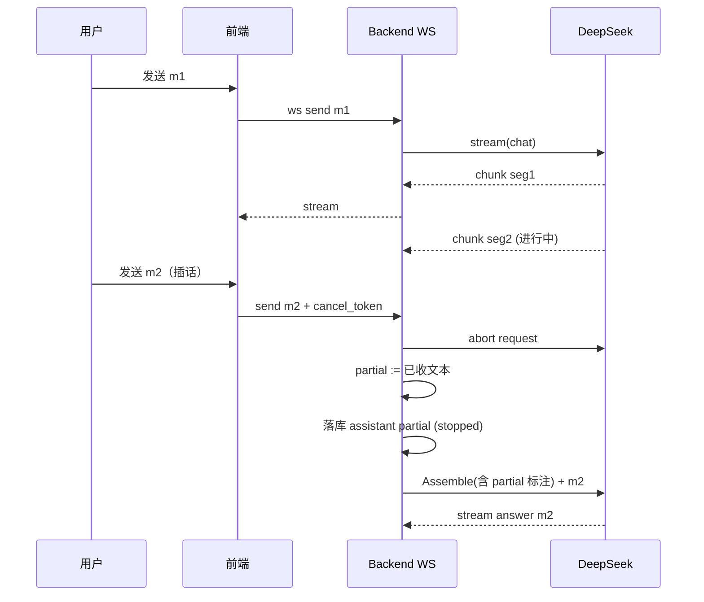
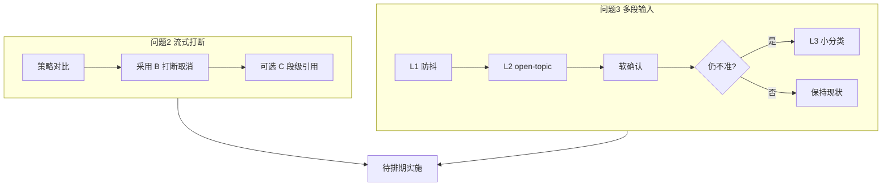

# 流式打断与多段用户输入 — 评估文档

> 状态：**评估 / 未实施**  
> 范围：问题 2（AI 输出中途插话）、问题 3（用户多段输入）  
> 关联现状：`ai_service.doStream`（已 SSE 流式）、`websocket.SendStreamChunk`、`chat_controller.HandleWebSocket`  
> 相关协议：`docs/SKILL-PROTOCOL.md`（问题 1 已落地）

---

## 0. 结论摘要

| 主题 | 建议 | 优先级 | 状态 |
|------|------|--------|------|
| 显式段分割（完整回复） | 空行/显式符/短句回退切段 + UI 分段展示 | P1 | **已落地 v1**（`service/segments.go`，本期不做打断） |
| 流式插话 | **打断取消（B）**，不做等播完队列 | P1 | 否，下一版本 |
| 段级引用回复 | 可选增强（C），依赖打断落地 | P2 | 否 |
| 用户多段输入 | **防抖合并 + open-topic + 不确定则确认**，先不上海量子 agent | P2 | 否 |
| Subagent 判话题边界 | 延后；用小分类调用代替完整 subagent | P3 | 否 |

---

## 1. 现状

### 1.1 输出侧

```text
Assemble → DeepSeek stream:true
  → doStream onStream(chunk)
  → hub.SendStreamChunk
  → 前端拼接气泡
  → SendComplete / SendCompleteWithDebug → 落库
```

- 已具备 **token 级流式**，但无 **业务级分段协议**（无 seg_id）。  
- 用户在生成中再次发消息时，当前实现倾向 **排队/覆盖体验不明确**，缺少 abort。

### 1.2 输入侧

- 无 composer 防抖合并策略文档化。  
- 无 open-topic / 未完话语状态。  
- 多段叙事只能靠用户显式说「还没说完」。

---

## 2. 问题 2：AI 输出中途被插话

### 2.1 场景

AI 一轮回复自然分成 3 段（或多段），流式输出到第 2 段时用户发送消息。关注点：

1. 已流出的内容要不要保留？  
2. 用户的消息要不要等 AI 说完？  
3. 若用户是在回复「第 1 段」，语义如何锚定？

### 2.2 策略对比

| 策略 | 行为 | 优点 | 缺点 | 业界参考 |
|------|------|------|------|----------|
| **A. 队列排队** | 等本轮 complete 再处理用户消息 | 实现简单、消息序完整 | 回复第 1 段时用户被无视；陪伴场景节奏差 | 早期客服机器人 |
| **B. 打断取消（推荐）** | abort 流；部分文本落库并标记 stopped；新消息立即新 turn | 低延迟、插话语义自然 | 模型可能「话到一半」；需 system 说明可中断 | ChatGPT / Claude Stop & 追问 |
| **C. 分段锚点** | 打断时 UI 记录 reply_to=seg_id；prompt 注入「针对第 N 段」 | 表达最准 | 要段级 ID + 引用 UI + 组装逻辑 | 邮件/文档评论、部分 IM |

**推荐：B 为默认，C 为二期增强。不要 A 作为产品默认。**

### 2.3 推荐形态（B + 可选 C）



### 2.4 关键设计点

#### （1）取消与部分落库

```text
conversation generation state:
  gen_id: uuid
  status: streaming | aborted | completed
  partial_text: string
  seg_boundaries: [offset...]   // 可选
  aborted_at_msg_id: int64
```

- WebSocket 增加客户端 → 服务端消息：`{type:"cancel_generation", gen_id}`  
- 或服务端在收到新的 `user` 消息时 **自动 cancel** 同会话进行中的 stream（陪伴产品更顺手）  
- `partial_text` 以 `assistant` 角色写入 messages，内容追加标记或系统 history 注明 `[未说完被用户打断]`

#### （2）下一轮 prompt 怎么写

在 history 或 system 侧让模型知道被打断：

```text
assistant: （未说完，被打断）宝宝我跟你说今天……
user: 等等，你第一段说的那个展是周末吗？
```

避免模型以为自己已完整回答。

#### （3）「回复第 2 段」（策略 C）

| 层 | 要求 |
|----|------|
| 流式协议 | 服务端在段边界（`\n\n` 或模型约定分隔）发 `{type:"segment", seg_id, index}` |
| 前端 | 每段可点击「引用回复」 |
| 用户消息 | `{content, reply_to:{msg_id, seg_index}}` |
| Assemble | user 消息前注入：`用户正在回复你输出的第 N 段：「…」` |

无 UI 引用时，用户口头说「第一段那个」也能靠 history 里的 partial 读到，精度较低。

#### （4）与分段「切完再对话」的对比

| 方案 | 评价 |
|------|------|
| 切分完成后才接受输入 | 实现直观，但产品体验差 |
| 生成中随时可插话（B） | 推荐 |
| 混合：短回复可插话，长叙事默认排队 | 可配置，增加复杂度 |

### 2.5 TTS / 语音注意点

当前 TTS 在 complete 后合成。若 abort：

- 只对 **已落库的 partial** 合成，或  
- **取消 TTS**（推荐：打断时语音也不再排队）  

`StylePromptFromEmotion` 使用本轮 emotion；插话后应以 **新 turn** 的情绪为准。

### 2.6 风险

| 风险 | 缓解 |
|------|------|
| 频繁打断导致 history 碎片 | partial 合并展示；摘要压缩时优先丢弃被弃用 partial 细节 |
| 模型重复开头 | history 标注 stopped；system 写「若前次未说完，可自然续上或以用户新输入为准」 |
| 双请求竞态 | gen_id 会话级串行；新 turn 前必须确认旧 stream 已 abort |

### 2.7 评估结论（问题 2）

- **采用 B**。  
- 分段仅作为 **渲染/引用层**，不是「等切分结束」的门闩。  
- C（seg_id 引用）在 B 稳定后再做。  
- 不引入「用户消息队列直到 AI 说完」作为默认行为。

---

## 3. 问题 3：用户多段输入

### 3.1 场景

用户想分多条消息把一件事说完，希望 AI **先等、后理解整段**，而不是每条都立刻回复。

显式咒语（「我说结束才算结束」）可用但繁琐，不适合作为默认交互。

### 3.2 方案阶梯

```text
L0 显式控制     用户输入「/more」「继续写」或长按发送草稿
L1 防抖合并     composer 防抖 + N 秒内短消息合并为同一 user turn
L2 open-topic   会话状态：上轮像未完？相关短消息 → 等待窗口 / 合并
L3 完整性分类   小模型/规则判断 complete | incomplete | follow_up
L4 话题 subagent 独立判断「话题是否未结束」（成本高）
```

**建议默认：L1 + L2 + 不确定时 LLM 软确认；L0 作为高级能力保留；L3 随精度需求加；L4 暂缓。**

### 3.3 L1 防抖合并（产品层，优先）

| 机制 | 参数建议 | 说明 |
|------|----------|------|
| 输入框防抖 | 用户仍在输入时不触发生成 | 依赖前端输入状态 |
| 连发合并窗口 | 600–1200ms | 短消息（如 < 30 字）且窗口内 |
| 发送语义 | Enter 发送 / Shift+Enter 换行 | 降低误拆 |
| 可选「连续输入」 | 输入框旁按钮，草稿多段再一次提交 | 显式 L0，无模型成本 |

合并后 history 形态：

```text
user:
  - 帮我看看周末安排
  - 还有就是那个展要不要提前买票
```

或单条多行 user 消息。

### 3.4 L2 open-topic 状态

挂到已有 `conversation_skill_states` 或独立字段：

```json
{
  "open_topic": true,
  "open_since": "2026-…",
  "last_user_acts": ["inform", "fragment"],
  "pending_parts": [],
  "boundary_score": 0.35
}
```

启发式（无模型）：

| 信号 | 更像完整 | 更像未完 |
|------|----------|----------|
| 问号、请求句式 | ✓ | |
| 无标点短句 | | ✓ |
| 「然后」「还有」「对了」「另外」 | | ✓ |
| 礼貌结束「先这样」「就这样」 | ✓ | |
| 与 open_topic 话题相关且短 | | ✓ |

行为：

```text
if open_topic && related_short_msg && within(wait_window):
    merge or delay_reply(wait_window)
elif boundary_score < threshold:
    character_soft_confirm("还有吗？不说我就先按这些回你啦")
else:
    normal_turn
```

**软确认**对女友人设自然，比沉默等待或抢答都好。

### 3.5 L3 完整性 / 话题边界分类

与情绪分类同一套路（复用 DeepSeek 小 JSON）：

```text
标签：complete | incomplete | follow_up | topic_shift
输入：最近 2–3 条 user 消息 + 可选 assistant 上一轮
输出：{"label":"...","confidence":0-1,"reason":"..."}
```

调用时机：仅在启发式置信度中等时调用（避免每条消息多一次 LLM）。

### 3.6 关于 Subagent

| 维度 | 独立 subagent | 轻量分类调用 |
|------|---------------|--------------|
| 延迟 | 高 | 低 |
| 工程 | 新编排、状态机 | 复用现有 AI service |
| 可解释 | 可输出讨论过程 | JSON 标签 |
| 适用 | 复杂任务型长叙事 | 陪伴聊天边界判断 |

**结论：陪伴场景不要一上来上 subagent。**  
若未来做「长篇故事共创 / 任务协作」，再考虑持状态的 dialog manager，而不是每次 spawn agent。

### 3.7 学术 / 业界相关研究（检索关键词）

| 方向 | 关键词 | 与本产品关系 |
|------|--------|--------------|
| 未完话语检测 | incomplete utterance detection, utterance completeness | 是否等待 |
| 对话行为分类 | dialogue act classification (SWDA, Molweni, DailyDialog) | inform / request / fragment |
| 话题分割 | TextTiling, topic segmentation, discourse segmentation | 用户多段叙事切分 |
| 增量对话 | incremental dialogue processing, turn-taking, gap/overlap | 抢话与打断建模 |
| 省略与指代 | ellipsis resolution, anaphora | 「还有那个呢」 |
| 对话状态跟踪 | dialogue state tracking (DST) | open-topic 简化版 |
| 任务型多轮 | collaborative discourse, common ground | 长任务是否说完 |

产品侧类似模式：

- IM 连续短消息合并为「一段话」气泡  
- 语音消息「按住说话」松开才发送（显式段边界）  
- ChatGPT 输入框在生成中仍可打字，Stop 后追问  

### 3.8 风险

| 风险 | 缓解 |
|------|------|
| 误合并：用户换话题被粘住 | 相似度/关键词；topic_shift 类别；合并后仍保留原始分条 |
| 误等待：用户已问完却等 | wait_window 短（≤2s）+ 超时必回 |
| 软确认变油腻 | 人设模板化确认语，可关闭 |

### 3.9 评估结论（问题 3）

- **L1 + L2 + 软确认** 作为产品默认。  
- **保留显式「继续写」** 给长输入用户，但不强制。  
- **完整性分类（L3）** 在误判反馈多时再上。  
- **Subagent（L4）** 本期不引入。

---

## 4. 与问题 1（Skill 协议）的关系

- 打断与多段输入 **不改变** skill frontmatter 协议。  
- 插话后的 **新 turn 仍走 Route(registry)**；emotion/activated_skills 以新消息为准。  
- open-topic 状态建议与 `conversation_skill_states` 同表或同 JSON，避免多处散落。

---

## 5. 若实施：建议里程碑

| 阶段 | 内容 | 验收 |
|------|------|------|
| M1 | stream cancel + partial 落库 + history 标注 | 生成中发送消息，无排队；Debug 可见 aborted |
| M2 | 前端 Stop 按钮 + 自动 cancel on send | 手测插话 |
| M3 | seg_id（可选）+ 引用回复 | 对段 2 追问，回答不跑偏 |
| M4 | 输入防抖合并 + open-topic | 连发 3 条短消息合并或软确认 |
| M5 | 完整性小分类（可选） | 错误等待/抢答率下降 |

---

## 6. 配置草案（未生效）

```env
CHAT_STREAM_CANCEL_ON_USER_SEND=true
CHAT_PARTIAL_MARK_STOPPED=true
USER_INPUT_MERGE_WINDOW_MS=800
USER_INPUT_WAIT_WINDOW_MS=2000
DIALOGUE_OPEN_TOPIC_ENABLED=true
UTTERANCE_CLASSIFIER_MODE=off   # off | heuristic | llm
```

---

## 7. 开放问题（需产品拍板）

1. 插话时 **语音 TTS** 是否也立即取消？（建议是）  
2. 被打断的 partial 在前端气泡如何展示？（半透明 +「已停止」？）  
3. 是否允许用户关闭软确认（「还有吗」）？  
4. 段级引用 UI 是否进入桌面端本期范围？

---

## 8. 总结



**一句话**：流式插话用「可取消 + 部分入史」，不要队列等播完；多段用户输入用「防抖 + 话题状态 + 不确定就问一句」，先不要 subagent。
